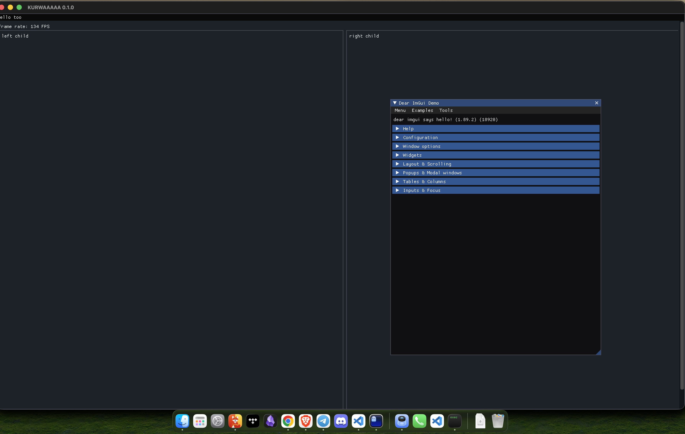

# Dear FM

File manager, written in Rust. Uses `eframe` framework for `egui` immediate mode
UI library.

Run:

```shell
cargo run
```



App state in `/Users/piotrlosiniecki/Library/Application Support/Dear-File-Manager-0.1.0/app.ron`
